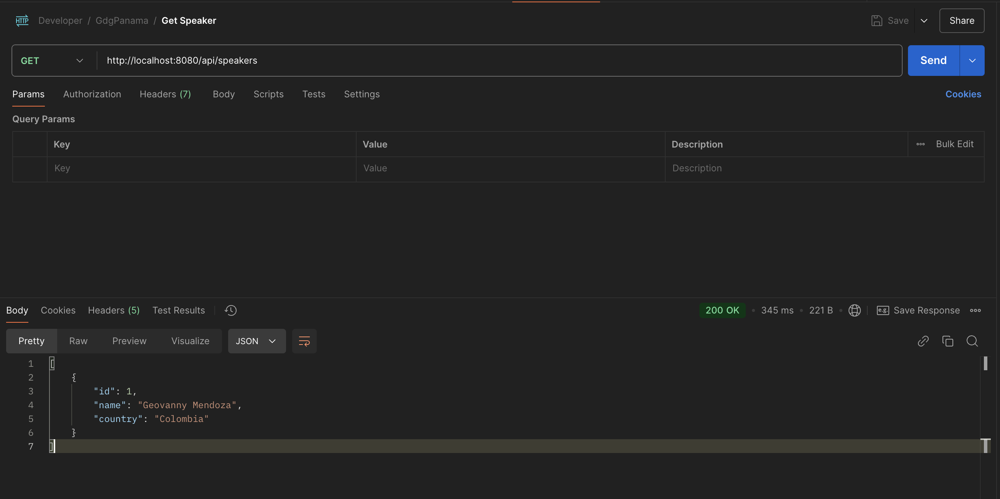

# **Fase 2: Creación de la Entidad, Repositorio, Servicio y Controlador**

En esta sección implementaremos los componentes principales para nuestra API REST. Adicionalmente, configuraremos **Flyway** para las migraciones de base de datos y utilizaremos un archivo `compose.yaml` para ejecutar PostgreSQL localmente.

## **Creación de la API REST y Pruebas Locales**

### **Estructura del Proyecto**

El proyecto está organizado en una estructura clara y modular, siguiendo las mejores prácticas de desarrollo con Spring Boot y Kotlin. La siguiente jerarquía de carpetas y archivos refleja cómo se distribuyen las responsabilidades dentro del proyecto:

```bash
src
 ├── main
 │   ├── kotlin
 │   │   └── com.geovannycode
 │   │       ├── 📄 KotlinGcpApplication.kt
 │   │       ├── 📄 Speaker.kt
 │   │       ├── 📄 SpeakerController.kt
 │   │       ├── 📄 SpeakerRepository.kt
 │   │       └── 📄 SpeakerService.kt
 │   └── resources
 │       ├── 📁 db
 │       │   └── migration
 │       │       ├── 📄 V1__Create_Speaker_Table.sql
 │       │       └── 📄 V2__Add_Data_Speaker.sql
 │       ├── 📁 static
 │       ├── 📁 templates
 │       └── 📁 application.properties
```

- **Paquete principal** (`com.geovannycode`): Aquí se encuentran las clases esenciales de la API:
    - `KotlinGcpApplication`: Es el punto de entrada de la aplicación. Inicializa Spring Boot y configura el servidor embebido (Tomcat). 
    - `Speaker`: Representa la entidad `Speaker` almacenada en la base de datos. Este modelo mapea los datos relacionales de la tabla PostgreSQL a un objeto Kotlin.
    - `SpeakerRepository`: Define las operaciones necesarias para interactuar con la base de datos. Hereda métodos predefinidos de Spring Data JPA como `findAll`, `save`, `findById`, y `deleteById`.
    - `SpeakerService`: Gestiona la lógica de negocio y las validaciones necesarias antes de interactuar con la base de datos.
    - `SpeakerController`: Maneja las solicitudes HTTP y expone los endpoints REST para interactuar con los servicios de la API.
- **Directorio de recursos** (`resources`):
    - Este directorio contiene configuraciones y scripts utilizados por la aplicación.
        - `db/migration`: Contiene los archivos SQL que Flyway utiliza para crear y modificar el esquema de la base de datos.
            - `V1__Create_Speaker_Table.sql`: Crea la tabla speakers.
            - `V2__Add_Data_Speaker.sql`: Inserta datos iniciales en la tabla para pruebas.
        - `application.properties `:
            - Archivo de configuración con datos de conexión a la base de datos y otras configuraciones de la aplicación.

## **1. Configuración Local: Base de Datos con Docker Compose**

El archivo `compose.yaml` es usado para definir y administrar servicios de contenedores. En este caso, configuramos un contenedor de `PostgreSQL` que servirá como nuestra base de datos en el entorno local. A continuación, explicamos cada sección del archivo.

```yaml title="docker-compose.yaml" linenums="1"
services:
  postgres_gcp:
    container_name: "postgres_gcp"
    image: 'postgres:16'
    env_file: ./.env
    ports:
      - ${DB_LOCAL_PORT}:${DB_DOCKER_PORT}
    environment:
      POSTGRES_USER: ${POSTGRES_USER}
      POSTGRES_PASSWORD: ${POSTGRES_PASSWORD}
      POSTGRES_DB: ${POSTGRES_DB}
```

- **Línea 1** `services`: Define los servicios que se van a levantar con `Docker Compose`. Aquí, configuramos un único servicio llamado `postgres_gcp` que corresponde a un contenedor de `PostgreSQL`.

- **Línea 2** `postgres_gcp`: Nombre del servicio dentro de Docker Compose. Este nombre puede ser utilizado para referenciar el contenedor en redes internas de Docker.

- **Línea 3** `container_name`: **"postgres_gcp"** Asigna un nombre al contenedor que será visible cuando listemos los contenedores con docker ps. En este caso, el contenedor se llamará `postgres_gcp`.

- **Línea 4** `image`: **'postgres:17'** Especifica la imagen que será utilizada para este servicio. Aquí usamos la versión `17` de la imagen oficial de PostgreSQL desde `Docker Hub`.

- **Línea 5** `env_file: ./env` Indica que las variables de entorno serán cargadas desde un archivo llamado `.env` en el mismo directorio donde está el `compose.yaml`. Esto permite mantener las credenciales sensibles (como el usuario, contraseña y puerto) fuera del archivo principal.

- **Línea 6** `ports`: Configura el mapeo de puertos entre el contenedor y el host local.
    - `${DB_LOCAL_PORT}:${DB_DOCKER_PORT}` Esto utiliza las variables definidas en el archivo `.env`. El puerto local (`DB_LOCAL_PORT`) estará conectado al puerto del contenedor (`DB_DOCKER_PORT`). Por ejemplo, si definimos `DB_LOCAL_PORT=5432`, la base de datos será accesible en `localhost:5432`.

- **Línea 7** `environment`: Declara las variables de entorno necesarias para configurar PostgreSQL en el contenedor.
    - `POSTGRES_USER`: Define el nombre del usuario administrador de la base de datos.
    - `POSTGRES_PASSWORD`: Asigna la contraseña del usuario administrador.
    - `POSTGRES_DB`: Especifica el nombre de la base de datos principal que se creará automáticamente cuando el contenedor se inicie.

- **Puntos Clave**
    1. **Configura las variables en el archivo** `.env`: Personaliza los valores como el puerto local, usuario y nombre de la base de datos.
    2. **Automatización con Docker Support**: Si estás utilizando Docker Support integrado en IntelliJ IDEA o tu herramienta de desarrollo, no es necesario ejecutar comandos manuales (`docker-compose up`). Al iniciar tu aplicación Spring Boot, Docker Support levanta automáticamente el contenedor de PostgreSQL. Esto simplifica el flujo de desarrollo.

- **Ventajas de Docker Compose con Docker Support**
    - **Ahorro de tiempo**: No necesitas ejecutar manualmente `docker-compose` siempre que inicies tu aplicación Spring Boot.
    - **Integración**: Docker Support coordina automáticamente la creación y administración del contenedor.
    - **Estandarización**: Al definir configuraciones en `.env`, todos los miembros del equipo pueden usar los mismos valores base.

## **2. Migraciones con Flyway**

Flyway es una herramienta de migración de base de datos que permite gestionar de forma controlada los cambios en el esquema y los datos iniciales. En este caso, utilizaremos Flyway para crear la tabla speakers y añadir datos iniciales en PostgreSQL.

### **2.1 Archivos  de Migración**

Flyway organiza los cambios en la base de datos mediante archivos de migración con un formato específico en el nombre, por ejemplo: `V1__Create_Speaker_Table.sql` y `V2__Add_Data_Speaker.sql`.

- `V1__Create_Speaker_Table.sql`
Este archivo contiene las instrucciones para crear la tabla `speakers` y su secuencia de IDs.

```sql title="V1__Create_Speaker_Table.sql" linenums="1"
CREATE SEQUENCE speaker_id_seq START 1 INCREMENT BY 50;

CREATE TABLE speakers (
    id BIGINT DEFAULT nextval('speaker_id_seq') NOT NULL,
    name VARCHAR(255) NOT NULL,
    country VARCHAR(255) NOT NULL,
    PRIMARY KEY (id)
);
```

- `V2__Add_Data_Speaker.sql`
Este archivo agrega un registro inicial en la tabla `speakers` para facilitar las pruebas.

```sql title="V2__Add_Data_Speaker.sql" linenums="1"
INSERT INTO speakers (id, name, country) VALUES (nextval('speaker_id_seq'), 'Geovanny Mendoza', 'Colombia');
```

### **2.2 Ubicación de los Archivos**

- Los archivos de migración deben estar ubicados en el directorio: `src/main/resources/db/migration`.

- Esto es importante porque Flyway, por defecto, escanea esta ruta para aplicar las migraciones.

### **2.3 Flujo de Migración**

- **Inicio de la aplicación**: Spring Boot detecta las configuraciones de Flyway y se conecta a la base de datos.
- **Verifica las migraciones pendientes**: Flyway consulta la tabla `flyway_schema_history` en la base de datos (si no existe, la crea automáticamente) para determinar qué migraciones aún no se han aplicado.
- **Aplica las migraciones**: Flyway ejecuta los archivos en orden de versión (por ejemplo, `V1`, `V2`, etc.).
- **Registro en `flyway_schema_history`**: Una vez aplicada una migración, Flyway registra el nombre del archivo, el estado y la fecha en esta tabla.

### **2.4 Ventajas de Flyway**

- **Control de versiones**: Cada cambio en el esquema está versionado y registrado.
- **Automatización**: Al iniciar la aplicación, Flyway aplica automáticamente las migraciones pendientes.
- **Reversibilidad**: Facilita el mantenimiento de la base de datos al permitir manejar múltiples entornos con un esquema consistente.

## **3. Implementación Técnica**

**Punto de Entrada**: `KotlinGcpApplication.kt`

El archivo `KotlinGcpApplication.kt` define el punto de entrada principal de nuestra aplicación. Es aquí donde Spring Boot inicia todo el proceso de configuración, creación de beans y levantamiento del servidor embebido (`Tomcat`).

```kotlin title="KotlinGcpApplication.kt" linenums="1"
@SpringBootApplication
class KotlinGcpApplication

fun main(args: Array<String>) {
    runApplication<KotlinGcpApplication>(*args)
}
```

Esta clase define el punto de entrada de la aplicación:

- **Línea 1** `@SpringBootApplication`: 
Esta anotación combina tres anotaciones clave de Spring Boot:
    - `@Configuration`: Marca la clase como una fuente de configuraciones de Spring.
    - `@EnableAutoConfiguration`: Activa la configuración automática de Spring Boot, cargando los componentes según las dependencias declaradas.
    - `@ComponentScan`: Escanea automáticamente el paquete actual y sus subpaquetes en busca de clases anotadas como `@Component`, `@Service`, `@Repository`, etc., para registrarlas como beans en el contexto de la aplicación.
- **Línea 2** `class KotlinGcpApplication`: 
    - Define una clase vacía con el nombre de la aplicación. Aunque no contiene lógica adicional, Spring Boot la utiliza como punto central para identificar el contexto principal de la aplicación.
    - **Nota**: El nombre de la clase es arbitrario, pero debe ser único dentro del paquete y representativo de la funcionalidad de la aplicación.
- **Línea 4**: `fun main(args: Array<String>)`
    - Define la función `main`, que es el punto de entrada estándar para cualquier aplicación escrita en Kotlin. Aquí es donde comienza la ejecución del programa.
- **Línea 5** `runApplication<KotlinGcpApplication>(*args)`:
Esta línea ejecuta la función `runApplication`, que realiza las siguientes tareas:
    - **Inicia Spring Boot**: Configura el contexto de la aplicación y todos los beans necesarios.
    - **Levanta el Servidor Embebido**: En este caso, inicia un servidor Tomcat que se ejecuta en el puerto `8080` por defecto.
    - **Carga los Recursos de Configuración**: Como `application.properties` o `application.yml`, que contienen configuraciones clave como la conexión a la base de datos.
    - **Procesa los Argumentos**: Los parámetros pasados en `args` se interpretan como argumentos de línea de comandos para personalizar el comportamiento de la aplicación en tiempo de ejecución.

**Nota**:
El operador `*` delante de `args` se llama spread operator en Kotlin. Descompone el arreglo de argumentos para que puedan ser pasados individualmente como parámetros a la función `runApplication`.

### **3.1 Modelo de Datos**: `Speaker.kt`

La clase `Speaker.kt` define el modelo de datos que representa la tabla `speakers` en la base de datos. Es una entidad JPA (Java Persistence API) que Spring Data utiliza para mapear automáticamente los registros de la base de datos a objetos Kotlin.

```kotlin title="Speaker.kt" linenums="1"
@Entity
@Table(name = "speakers")
data class Speaker(
    @Id
    @GeneratedValue(strategy = GenerationType.SEQUENCE, generator = "speaker_id_generator")
    @SequenceGenerator(name = "speaker_id_generator", sequenceName = "speaker_id_seq")
    val id: Long? = null,
    val name: String,
    val country: String
)
```

- **Línea 1** `@Entity`: 
    - Marca la clase como una entidad JPA, lo que indica que está vinculada a una tabla en la base de datos.
    - `Spring Boot`: Detecta esta anotación durante el escaneo de componentes (gracias a `@SpringBootApplication`) y registra automáticamente la clase como una entidad administrada.
- **Línea 2**: `@Table(name = "speakers")`:
    - Especifica el nombre de la tabla en la base de datos asociada con esta entidad.
- **Línea 3** `data class`: 
    - La clase `Speaker` está definida como una **data class**, lo que aporta las siguientes ventajas:
        - **Inmutabilidad**:
            - Los valores de las propiedades son constantes (`val`) y no pueden ser modificados después de la creación del objeto.
            - Esto es útil en aplicaciones donde los datos no deben cambiarse accidentalmente.
        - **Métodos Automáticos Generados**:
            - `toString`: Proporciona una representación de texto para imprimir fácilmente los objetos.
            - `equals` y `hashCode`: Facilitan la comparación entre objetos.
            - `copy`: Permite crear una nueva instancia basada en un objeto existente con cambios en algunas propiedades.
        - **Compatibilidad con Kotlin/JPA**:
            - Las `data class` se integran bien con JPA, siempre que cumplan las reglas básicas (como constructor primario completo).
- **Línea 4** `@Id`: Define este campo como la clave primaria de la tabla.
- **Línea 5** `@GeneratedValue`: Especifica que el valor de este campo será generado automáticamente.
    - `strategy = GenerationType.SEQUENCE`: Usa una estrategia de secuencia, que es eficiente para PostgreSQL.
    - `generator = "speaker_id_generator"`: Asocia este campo a un generador de secuencias específico.
- **Línea 6** `SequenceGenerator`: Configura el generador de secuencias.
    - `name = "speaker_id_generator"`: Nombre del generador asociado.
    - `sequenceName = "speaker_id_seq"`: Nombre de la secuencia en la base de datos que generará los valores del campo `id`.
- **Línea 7**: `Nullable` Se define como `Long? = null` porque el valor inicial es `null` hasta que se genera automáticamente al guardar el registro.
- **Campos**:
    - `id`: Clave primaria generada automáticamente usando una secuencia PostgreSQL.
    - `name`: Almacena el nombre del speaker.
    - `country`: Almacena el país de origen del speaker.

### **3.2 Repositorio**: `SpeakerRepository.kt`

El repositorio es una interfaz que permite interactuar con la base de datos de manera directa, manejando operaciones CRUD (`Crear, Leer, Actualizar y Eliminar`) sin necesidad de escribir código SQL manualmente. En este caso, `SpeakerRepository` hereda de `CrudRepository`, una clase proporcionada por Spring Data JPA.

```kotlin title="SpeakerRepository.kt" linenums="1"
@Repository
interface SpeakerRepository : CrudRepository<Speaker, Long>
```

- **Línea 2**: `interface SpeakerRepository : CrudRepository<Speaker, Long>`
    - `interface`: Define que `SpeakerRepository` es una interfaz, no una clase.
    - `: CrudRepository<Speaker, Long>`:
        - `CrudRepository` es una interfaz genérica que requiere dos parámetros:
        - `Speaker`: Es la entidad sobre la que este repositorio operará.
        - `Long`: Es el tipo de dato de la clave primaria de la entidad Speaker.

**Nota Importante**:
Spring implementa automáticamente esta interfaz al detectar su definición durante el escaneo de componentes. No es necesario escribir código adicional para implementar esta interfaz, lo que ahorra tiempo y esfuerzo.

- Este repositorio hereda de `CrudRepository`, proporcionando métodos como:
    - **`findById`**: Busca un registro por su ID.
    - **`findAll`**: Devuelve todos los registros.
    - **`save`**: Guarda o actualiza un registro.
    - **`deleteById`**: Elimina un registro por ID.

### **3.3 Servicio**: `SpeakerService.kt`

El archivo `SpeakerService.kt` implementa la lógica de negocio para la API REST. Actúa como un intermediario entre el controlador y el repositorio, asegurando que las operaciones CRUD (`Crear, Leer, Actualizar y Eliminar`) se realicen de manera controlada.

```kotlin title="SpeakerService.kt" linenums="1"
@Service
@Transactional
class SpeakerService(val repo: SpeakerRepository) {
    fun getSpeakers(): List<Speaker> = repo.findAll().toList()
    fun getSpeaker(id: Long) = repo.findById(id)
    fun createSpeaker(speaker: Speaker) = repo.save(speaker)
    fun deleteSpeaker(id: Long) = repo.deleteById(id)
    fun updateSpeaker(id: Long, updatedSpeaker: Speaker): Speaker? {
        return if (repo.existsById(id)) {
            val speakerToUpdate = updatedSpeaker.copy(id = id)
            repo.save(speakerToUpdate)
        } else {
            null
        }
    }
}
```

- **Línea 1**: `@Service` Marca esta clase como un servicio administrado por **Spring**. Spring Boot Detecta automáticamente esta anotación durante el escaneo de componentes y la registra como un `bean` disponible en el contenedor de la aplicación.
    - **Ventaja**: Permite inyectar esta clase en otros componentes (`como el controlador)` sin necesidad de inicializarla manualmente.
- **Línea 2**: `@Transactional` Garantiza que todas las operaciones dentro de este servicio se ejecuten dentro de una transacción.
    - **Ventajas**:
        - Si ocurre un error en cualquier parte del método, todas las operaciones realizadas dentro de la transacción serán revertidas.
        - Asegura consistencia en la base de datos.
- **Línea 3** `Constructor: private val repo: SpeakerRepository`
    - Inyecta automáticamente el repositorio `SpeakerRepository` en el servicio.
    - Esto permite acceder a los métodos predefinidos en `CrudRepository` (como `findAll`, `save`, etc.) para interactuar con la base de datos.
- **Línea 4** `getSpeakers`: Devuelve una lista de todos los registros en la tabla speakers.
    - **Detalle**:
        - `repo.findAll()`: Devuelve un `Iterable<Speaker>`.
        - `.toList()`: Convierte el iterable en una lista, que es más fácil de manejar.
- **Línea 5** `getSpeaker`: Busca un registro por su clave primaria (`id`) y lo devuelve. Si no existe, devuelve `null`.
    - **Detalle**:
        - `repo.findById(id)`: Devuelve un `Optional<Speaker>`.
        - `.orElse(null)`: Extrae el valor si existe, o devuelve `null` si no lo encuentra.
- **Línea 6** `createSpeaker`: Inserta un nuevo registro en la base de datos.
    - **Detalle**:
        - `repo.save(speaker)`: Guarda el objeto `Speaker` en la base de datos y devuelve la entidad guardada con su clave primaria (`id`) asignada.
- **Línea 7** `deleteSpeaker`: Elimina un registro por su clave primaria (id).
    - **Detalle**:
        - `repo.deleteById(id)`: Elimina el registro correspondiente en la base de datos.
- **Línea 8** `updateSpeaker`: Actualiza un registro existente en la base de datos. Si no existe, devuelve null.
    - **Detalle**:
        - `repo.existsById(id)`: Verifica si el registro con el `id` especificado existe.
        - `updatedSpeaker.copy(id = id)`: Crea una nueva instancia del objeto `Speaker` con el id correcto.
        - `repo.save(speakerToUpdate)`: Guarda el registro actualizado.

### **3.4 Controlador REST**: `SpeakerController.kt`

El controlador REST es la capa que expone la lógica de negocio a través de la red utilizando la arquitectura REST (**Representational State Transfer**). Esto permite interactuar con la API mediante solicitudes HTTP estándar como `GET`, `POST`, `PUT`, `DELETE`, entre otros.

**¿Por Qué @RestController?**

- `@RestController` es una anotación de Spring que combina `@Controller` y `@ResponseBody`.
- Todos los métodos en una clase marcada como `@RestController` retornan automáticamente los datos en formato JSON o XML, según lo que soporte el cliente.

- **Ventajas**:
    - Simplifica la creación de controladores RESTful al eliminar la necesidad de agregar `@ResponseBody` en cada método.
    - Los datos devueltos por los métodos no se renderizan como vistas HTML (como lo haría un `@Controller` tradicional), sino como una respuesta HTTP con un cuerpo en formato JSON.

- **Arquitectura REST**:
    - REST sigue los principios HTTP para operar con recursos.
    - Cada recurso tiene una representación única (en este caso, la entidad Speaker) y puede ser manipulado utilizando verbos HTTP.

```kotlin title="SpeakerController.kt" linenums="1"
@RestController
@RequestMapping("/api/speakers")
class SpeakerController(private val service: SpeakerService) {

    // 1. Recuperar todos los registros
    @GetMapping
    fun getSpeakers(): ResponseEntity<List<Speaker>> =
        ResponseEntity.ok(service.getSpeakers())

    // 2. Recuperar un registro por ID
    @GetMapping("/{id}")
    fun getSpeaker(@PathVariable id: Long): ResponseEntity<Speaker> =
        service.getSpeaker(id).map { ResponseEntity.ok(it) }
            .orElse(ResponseEntity.notFound().build())

    // 3. Crear un nuevo registro
    @PostMapping
    fun createSpeaker(@RequestBody speaker: Speaker): ResponseEntity<Speaker> =
        ResponseEntity.ok(service.createSpeaker(speaker))

    // 4. Eliminar un registro por ID
    @DeleteMapping("/{id}")
    fun deleteSpeaker(@PathVariable id: Long): ResponseEntity<Void> {
        service.deleteSpeaker(id)
        return ResponseEntity.noContent().build()
    }

    // 5. Actualizar un registro existente
    @PutMapping("/{id}")
    fun updateSpeaker(@PathVariable id: Long, @RequestBody updatedSpeaker: Speaker): ResponseEntity<Speaker> {
        val updated = service.updateSpeaker(id, updatedSpeaker)
        return if (updated != null) {
            ResponseEntity.ok(updated)
        } else {
            ResponseEntity.notFound().build()
        }
    }
}
```

Este archivo expone los endpoints para interactuar con la API:

- **Líneas 6-8**: Define el método que maneja solicitudes `GET` en el endpoint `/api/speakers`.
    - Permitir al cliente obtener una lista de todos los `Speaker` registrados en la base de datos.
    - **Anotaciones importantes**: `@GetMapping` Especifica que este método manejará solicitudes HTTP con el verbo `GET`. Este tipo de solicitud se utiliza comúnmente para recuperar información sin modificar el estado del servidor.
    - **Flujo del método**: Llama al servicio (`service.getSpeakers()`) para recuperar una lista con todos los registros de `Speaker`.
        - Devuelve un `ResponseEntity` con:
            - **Código HTTP** `200 OK`, que indica éxito en la solicitud.
            - **Cuerpo de la respuesta**: Un listado JSON con los objetos `Speaker`.
        - **Códigos de respuesta**:
            - **200 OK**: Indica que la solicitud fue exitosa. Si no hay speakers registrados, se devuelve una lista vacía.

- **Líneas 11-14**: Define el método que maneja solicitudes `GET `con un parámetro dinámico (`id`) en el endpoint `/api/speakers/{id}`.
    - Permitir al cliente recuperar la información de un `Speaker` específico usando su ID único.
    - **Anotaciones importantes**: `@GetMapping("/{id}")` Asigna este método a solicitudes `GET` con un identificador dinámico (`{id}`) en la URL. y con el `@PathVariable` Extrae el valor `{id}` de la URL y lo asigna al parámetro `id`. Esto facilita el uso de rutas dinámicas.
    - **Flujo del método**: El servidor recibe la solicitud con el ID proporcionado en la URL.
        - Llama al servicio (`service.getSpeaker(id)`) para buscar el `Speaker` correspondiente.
        - Si el registro es encontrado devuelve un `ResponseEntity` con:
            - **Código HTTP** `200 OK`, que indica éxito en la solicitud.
            - **Cuerpo de la respuesta**: El objeto `Speaker` encontrado.
        - Si no existe devuelve un `ResponseEntity` con:
            - **Código HTTP** `404 Not Found`, indicando que el recurso solicitado no existe.
        - **Códigos de respuesta**:
            - `200 OK`: El `Speaker` fue encontrado exitosamente.
            - `404 Not Found`: No se encontró ningún registro con el ID proporcionado.

- **Líneas 17-19**: Define el método que maneja solicitudes `POST` en el endpoint `/api/speakers`.
    - Este método permite al cliente crear un nuevo registro de `Speaker` enviando los datos en formato `JSON`. Utiliza el servicio (`service.createSpeaker`) para procesar y almacenar el objeto recibido en la base de datos.
    - **Anotaciones importantes**: `@PostMapping` Especifica que este método responderá a solicitudes `HTTP` con el verbo `POST`. Este tipo de solicitud se utiliza comúnmente para crear nuevos recursos en un servidor. Por otro lado el  `@RequestBody` indica que el cuerpo de la solicitud HTTP (`enviado por el cliente`) será deserializado automáticamente a un objeto `Speaker`. Esto simplifica la lectura de datos `JSON` enviados por el cliente.
    - **Flujo del método**: Recibe un objeto JSON en el cuerpo de la solicitud (por ejemplo, un Speaker con atributos como name y country).
        - Convierte este `JSON` a un objeto `Speaker` usando la anotación `@RequestBody`.
        - Llama al servicio (`service.createSpeaker(speaker)`) para guardar este objeto en la base de datos.
        - Devuelve un `ResponseEntity` con:
            - **Código HTTP** `200 OK` indicando que la solicitud se procesó correctamente.
            - **Cuerpo de la respuesta**: El objeto Speaker recién creado, con su `id` generado automáticamente por la base de datos.
        - **Códigos de respuesta**:
            - `200 OK`: Se devuelve cuando el objeto se crea correctamente.
            - `Errores`: No se manejan errores explícitos en este método, pero posibles problemas (como validación fallida) se deben manejar en otro nivel (por ejemplo, en las anotaciones de validación).

- **Líneas 22-26**: Define el método que maneja solicitudes `DELETE` en el endpoint `/api/speakers/{id}`.
    - Permitir al cliente eliminar un `Speaker` específico usando su `ID` único.
    - **Anotaciones importantes**: `@DeleteMapping("/{id}")` Asigna este método a solicitudes `DELETE` con un identificador dinámico en la `URL` y el `@PathVariable` Extrae el valor `{id}` de la URL y lo asigna al parámetro `id`.
    - **Flujo del método**: El servidor recibe la solicitud con el ID del recurso a eliminar.
        - Llama al servicio (service.deleteSpeaker(id)) para realizar la eliminación en la base de datos.
        - Devuelve un ResponseEntity con:
            - **Código HTTP** `200 OK`, que indica éxito en la solicitud.
        - **Códigos de respuesta**:
            - **`204 No Content`**: El Speaker fue eliminado exitosamente.

- **Líneas 29-37**: Define el método que maneja solicitudes `PUT` en el endpoint `/api/speakers/{id}`.
    - Permitir al cliente actualizar un registro existente de `Speaker` enviando los nuevos datos en formato `JSON`.
    - **Anotaciones importantes**: `@PutMapping("/{id}")` Asigna este método a solicitudes `PUT` con un identificador dinámico en la URL. y `@PathVariable` Extrae el valor `{id}` de la URL y lo asigna al parámetro `id` y por ultimo `@RequestBody` que convierte el cuerpo `JSON` de la solicitud en un objeto Speaker.
    - **Flujo del método**: Recibe un objeto JSON con los nuevos datos del Speaker.
        - Llama al servicio (`service.updateSpeaker(id, updatedSpeaker)`) para realizar la actualización.
        - Si el registro existe devuelve un `ResponseEntity` con:
            - **Código HTTP** `200 OK`.
            - **Cuerpo de la respuesta**: El objeto Speaker actualizado.
        - Si no existe devuelve un `ResponseEntity` con:
            - **Código HTTP** `404 Not Found`
        - **Códigos de respuesta**:
            - **`200 OK`**: El `Speaker` fue actualizado exitosamente.
            - **`404 Not Found`**: No existe un registro con el ID proporcionado.

## **4. Pruebas Locales con Postman**

Una vez que la `API REST` está implementada y la base de datos configurada, podemos probar los endpoints utilizando Postman, una herramienta de pruebas para APIs REST.

La `Figura #1` muestra un ejemplo de la respuesta al probar este endpoint con `Postman`.


<p align="center">
  <strong>Figura # 1:</strong> Representación del Postman
</p>

- Ejemplo:
    - **`GET /api/speakers`**: Recupera todos los speakers.
    - **`POST /api/speakers`**: Crea un nuevo speaker con este JSON:
        ```json
        {
            "name": "John Doe",
            "country": "USA"
        }
        ```
    - **`PUT /api/speakers/{id}`**: Actualiza un speaker.
    - **`DELETE /api/speakers/{id}`**: Elimina un speaker.

## **5. Continuación del Proyecto**

En la próxima `sesión/documento`, avanzaremos con la integración de esta API REST en **`Google Cloud Platform (GCP)`**. 

- Exploraremos las siguientes tareas:
    - Despliegue de la aplicación en App Engine.
    - Configuración de la base de datos en Cloud SQL.
    - Automatización del flujo de despliegue utilizando Cloud Build.

¡Prepárate para llevar esta aplicación a la nube! 🚀

## **6. Resumen General**

En este taller, desarrollamos una API REST con Kotlin, Spring Boot y PostgreSQL. 

Los pasos principales fueron:

- **Configuración del Proyecto**: 
    - Usamos `Spring Initializr` para generar el proyecto con dependencias clave.
    - Organizamos el código en paquetes y recursos para una estructura clara.

- **Implementación de la API**:
    - Creamos la entidad `Speaker`, el repositorio `SpeakerRepository`, el servicio `SpeakerService` y el controlador `SpeakerController` para exponer endpoints REST (`GET, POST, PUT, DELETE`).
    - Implementamos lógica de negocio para gestionar operaciones `CRUD`.

- **Base de Datos Local**:
    - Configuramos PostgreSQL con Docker Compose.
    - Usamos Flyway para manejar migraciones de base de datos y datos iniciales.

- **Pruebas Locales**:
    - Probamos los endpoints con Postman, verificando códigos de respuesta (`200 OK, 404 Not Found, etc.`) y datos retornados en formato `JSON`.

- **Próximos Pasos**
    - En la próxima sesión, desplegaremos esta API en `Google Cloud Platform (GCP)` utilizando `App Engine`, `Cloud SQL` y `Cloud Build`.
