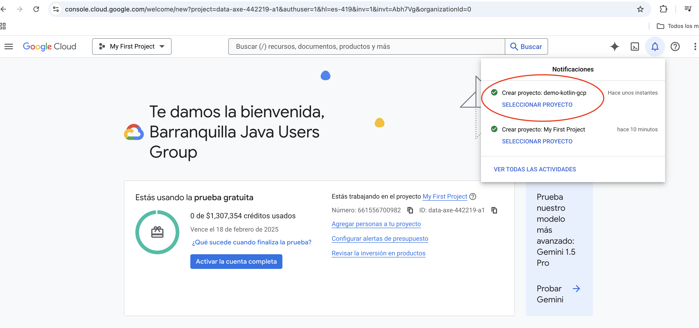
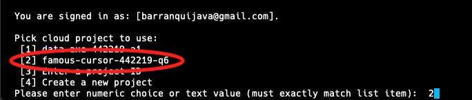

# **Despliegue de una API REST con Kotlin en Google Cloud con PostgreSQL**

Introducción
El desarrollo y despliegue de aplicaciones modernas en la nube permite a los desarrolladores crear APIs robustas, escalables y seguras. En esta guía aprenderás a desplegar una API REST construida con Kotlin y Spring Boot en Google Cloud App Engine, con PostgreSQL como base de datos.

Este proceso incluye la configuración de un proyecto en Google Cloud, la creación de una instancia de base de datos en Cloud SQL, y el despliegue de la aplicación en un entorno gestionado con soporte de escalabilidad automática. También integraremos herramientas como [Google Cloud SDK](https://cloud.google.com/sdk/docs/install?hl=es-419){:target="_blank"} para facilitar la gestión y despliegue de recursos.

## **Paso 1: Configuración del Proyecto en Google Cloud**

1. **Creación de un Proyecto en Google Cloud**

Antes de iniciar, asegúrate de haber iniciado sesión en tu cuenta de **Google Cloud**.

- En el panel principal de Google Cloud, selecciona la opción **"Nuevo Proyecto"** como se muestra en la **Figura #1**:

<p align="center">
  <strong>Figura # 1:</strong> Nuevo Proyecto
</p>
- En la pantalla emergente, asigna un nombre al proyecto, por ejemplo, `demo-kotlin-gcp`, y presiona el botón **`Crear`** (**ver Figura #2**):

<p align="center">
  <strong>Figura # 2:</strong> Nombre al proyecto
</p>
- Una vez creado el proyecto, selecciona el proyecto desde las notificaciones o el menú desplegable (**ver Figura #3**):

<p align="center">
  <strong>Figura # 3:</strong> Notificación del proyecto
</p>

## **Paso 2:  Creación de una Base de Datos en Cloud SQL**

1. **Configuración de la Instancia**

Desde el menú lateral de Google Cloud, selecciona la opción **SQL** para acceder a la sección de bases de datos (**ver Figura #4**):

<p align="center">
  <strong>Figura # 4:</strong> Bases de Datos
</p>

   - Haz clic en **Crear Instancia** con *Créditos Gratuitos* para iniciar el proceso de creación (**ver Figura #5**):

<p align="center">
  <strong>Figura # 5:</strong> Crear Instancia
</p>

- Selecciona **PostgreSQL** como el motor de base de datos para la instancia (**ver Figura #6**):

<p align="center">
  <strong>Figura # 6:</strong> Seleccionar PostgreSQL
</p>

- Configura los parámetros iniciales de la instancia:
    - **Ajuste predeterminado de edición**: Zona de pruebas.
    - **Versión de la base de datos**: PostgreSQL 16.
    - **ID de la instancia**: kotlinbase.
    - **Contraseña**: kotlinroot.
    - **Región**: Selecciona una cercana como us-central1.
    - **Disponibilidad zonal**: Zona única (**ver Figura #7**):

<p align="center">
  <strong>Figura # 7:</strong> Parámetros de la instancia
</p>
- Personaliza los recursos de la máquina para optimizar costos. Selecciona la opción **Con núcleo compartido** con 1 CPU virtual (**ver Figura #8**):

<p align="center">
  <strong>Figura # 8:</strong> Personaliza Instancia
</p>
- Haz clic en **Crear** para finalizar la configuración (**ver Figura #9**):.

<p align="center">
  <strong>Figura # 9:</strong> Crear Instancia
</p>

- **Crear una Base de Datos**:
  - Una vez creada la instancia, accede a la pestaña **Bases de Datos** y haz clic en **Crear Base de Datos**. (**Figura #10**).

<p align="center">
  <strong>Figura # 10:</strong> Base de Datos
</p>
  - Asigna un nombre, como `kotlindb`. y presionar el boton **Crear** (**Figura #11**). 

<p align="center">
  <strong>Figura # 11:</strong> Crear Base de Datos
</p>

## **Paso 3: Configuración de Conexión Pública**

En este paso, configuraremos el acceso público para la base de datos PostgreSQL en Google Cloud SQL. Esto permitirá conectar herramientas locales como DBeaver para verificar y gestionar los datos.

- **Habilitar la Conexión Pública**
  - Accede a la instancia de la base de datos PostgreSQL en la consola de Google Cloud.
  - Navega a la sección **Conexiones** en el menú lateral (**Ver Figura #12**).

<p align="center">
  <strong>Figura # 12:</strong> Conexión
</p>
  - En la pestaña **Redes**, marca la opción **IP Pública** para habilitar conexiones externas.
  - Haz clic en **Agregar una Red** para configurar redes autorizadas.

- **Configurar la Red Permitida**
    - En la ventana emergente, completa los siguientes campos (**Ver Figura #13**):
        - **Nombre**: Ingresa un nombre descriptivo, como `abierta`.
        - **Red**: Introduce `0.0.0.0/0` para permitir conexiones desde cualquier dirección IP.

<p align="center">
  <strong>Figura # 12:</strong> Agregar Red
</p>
- Haz clic en **Guardar** para aplicar los cambios.

⚠️ **Advertencia**: Esta configuración permite conexiones desde cualquier lugar y puede ser un riesgo de seguridad. Se recomienda usar esta configuración solo en entornos de desarrollo.

- **Probar la Conexión con DBeaver**
    - Abre **DBeaver** (o cualquier cliente de base de datos).
    - Crea una nueva conexión seleccionando **PostgreSQL** como tipo de base de datos.
    - Completa los campos con los detalles obtenidos de la instancia:
        - **Host**: IP pública de la instancia (disponible en la consola de Google Cloud).
        - **Puerto**: `5432`.
        - **Usuario**: `postgres`.
        - **Contraseña**: La configurada previamente (`kotlinroot` en este ejemplo).
    - Haz clic en **Probar conexión** para confirmar que todo funciona correctamente (**Ver Figura #14**).
        
            <p align="center">
                <strong>Figura # 14:</strong> Probar Conexión
            </p>

## **Paso 4: Instalación y Configuración del SDK de Google Cloud**

Google Cloud SDK nos permitirá desplegar la aplicación desde la línea de comandos.

- **Descargar e Instalar el SDK**
    - Ve a la [página oficial del SDK de Google Cloud](https://cloud.google.com/sdk/docs/install?hl=es-419).
    - Descarga la versión para tu sistema operativo y sigue las instrucciones de instalación.
    - Ejecuta el comando `./google-cloud-sdk/bin/gcloud init` en tu terminal para configurar el SDK.
        - Acepta las configuraciones predeterminadas y selecciona el proyecto en el que trabajas (**Ver Figura #15**).

        <p align="center">
            <strong>Figura # 15:</strong> Condiguración del SDK Google Cloud
        </p>

- **Seleccionar el Proyecto**
    - Durante la configuración del SDK, selecciona el proyecto en el que se creó la base de datos.
    - Confirma el proyecto elegido con el identificador correspondiente (**Ver Figura #16**).

        <p align="center">
            <strong>Figura # 16:</strong> Selección del Proyecto
        </p>

    - Sigue los pasos interactivos para autenticarte y vincular el proyecto `kotlingcp`.
    - Puedes listar la configuración actual del proyecto con:
        ```bash
            ./google-cloud-sdk/bin/gcloud config list
        ```

Crea el archivo `.gcloudignore` para excluir carpetas y archivos innecesarios en el despliegue:

```text
.gradle/
build/
out/
gradlew
gradlew.bat

target/
.git/
.idea/
*.iml
.mvn/
mvnw
mvnw.cmd
```

- **Configurar App Engine**
    - **Crear el archivo `app.yaml`**: Este archivo define las especificaciones del entorno donde se ejecutará la aplicación. Crea un archivo `app.yaml` en la raíz del proyecto con el siguiente contenido:
```yaml
runtime: java21
instance_class: F2
```
    - `runtime`: Especifica el entorno para aplicaciones Java.
    - `instance_class`: Selecciona la clase de máquina. F2 es una opción equilibrada para aplicaciones Spring Boot.

- **Ejecutar el Despliegue**: 
    - Para desplegar la aplicación en `App Engine`, usa el siguiente comando:
        ```bash
            gcloud app deploy
        ```
    - Selecciona la región más cercana a tu ubicación (como `us-central1` para América Central) si es tu primer despliegue. Una vez completado, obtendrás una URL similar a:
        ```arduino
            https://famous-cursor-442219-q6.rj.r.appspot.com
        ```
    - **Verificación**: Accede a la URL y asegúrate de que la aplicación esté funcionando correctamente. Por ejemplo, verifica los endpoints /speakers.

## **Paso 5: Habilitar la API de Cloud SQL Admin**

- **Mejorar la Seguridad de la Aplicación**
Después del despliegue inicial, es importante fortalecer la seguridad.

- **Eliminar la IP Pública**
    - Ve a la consola de **Google Cloud SQL**.
    - En la sección Conexiones > **Redes**, elimina la red pública `0.0.0.0/0`.
    - Esto impedirá el acceso desde cualquier IP pública. (**Ver Figura #17**)

        <p align="center">
            <strong>Figura # 17:</strong> Eliminar IP Publica
        </p>

Para realizar una conexión segura con la base de datos, habilitaremos la API Cloud SQL Admin, que permite gestionar instancias de bases de datos desde aplicaciones desplegadas en Google Cloud.

- **Activar la API**
    - En la consola de Google Cloud, busca **Cloud SQL Admin API** en el buscador de la parte superior.
    - Haz clic en **Habilitar** para activar la API (**Ver Figura #17**).


        <p align="center">
            <strong>Figura # 17:</strong> Activar API
        </p>

Esto permitirá a las cuentas de servicio de Google gestionar conexiones a la base de datos de manera segura.

## **Paso 6: Configuración de Dependencias en el Proyecto Kotlin**

En este paso, ajustaremos las dependencias necesarias para conectar nuestra aplicación a Cloud SQL.
En lugar de usar la IP pública, configura la conexión usando cadenas seguras proporcionadas por Google.

- **Agregar la Dependencia de PostgreSQL**
    - Abre el archivo `pom.xml` de tu proyecto.
    - Agrega la dependencia correspondiente para usar PostgreSQL con Google Cloud:

```xml
<dependency>
    <groupId>com.google.cloud</groupId>
    <artifactId>spring-cloud-gcp-starter-sql-postgresql</artifactId>
</dependency>
```

Si usas `Gradle`, agrega lo siguiente en tu archivo `build.gradle`:

```gradle
implementation("com.google.cloud:spring-cloud-gcp-starter-sql-postgresql")
```

(**Ver Figura #18**)

        <p align="center">
            <strong>Figura # 18:</strong> Adicionar Dependencia
        </p>


- **Configurar la Cadena de Conexión**
Modifica las propiedades de conexión de la base de datos. En lugar de una URL con IP, usa la configuración proporcionada por Google:
    - Accede a las propiedades de tu aplicación (`application.properties` o `application.yml`).
    - Configura los valores de conexión utilizando el nombre de la conexión (disponible en la consola de Google Cloud en la instancia de PostgreSQL) (**Ver Figura #19**):

```properties
# Configuración de conexión segura
spring.cloud.gcp.sql.database-name=kotlindb
spring.cloud.gcp.sql.instance-connection-name=famous-cursor-442219-q6:us-central1:kotlinbase
spring.datasource.username=postgres
spring.datasource.password=kotlinroot
```

**Nota**: Comenta cualquier configuración previa de URL para evitar conflictos:

```properties
# spring.datasource.url=jdbc:postgresql://<IP_PUBLICA>:5432/kotlindb
```


        <p align="center">
            <strong>Figura # 19:</strong> Conexión Cloud SQL
        </p>

## **Paso 7: Configuración IAM y Despliegue**

Asegúrate de que la cuenta de servicio predeterminada de App Engine tenga los roles necesarios para gestionar Cloud SQL:

- **Configurar Credenciales Locales**
    - Usa el siguiente comando para autenticar tu máquina local con las credenciales de Google Cloud:
```bash
gcloud auth application-default login
```

    - Esto abrirá el navegador para seleccionar tu cuenta de Google Cloud.

- **Revisar Cuentas de Servicio**
    - Verifica que la cuenta de servicio predeterminada de `App Engine` tenga permisos de acceso a Cloud SQL (**Ver Figura #20**).


        <p align="center">
            <strong>Figura # 20:</strong> IAM
        </p>

- **Probar la Aplicación Localmente**
Corre la aplicación localmente y verifica que se conecte correctamente a la base de datos:

```bash
./gradlew bootRun
```

Asegúrate de que el endpoint `/spearkes` funcione como se espera.

- **Desplegar la Aplicación**
    - Ejecuta el siguiente comando para desplegar: Después de los ajustes de seguridad, ejecuta nuevamente el despliegue
```bash
gcloud app deploy
```

    - Confirma que la aplicación se conecta correctamente a la base de datos y que los endpoints están funcionando.

- **Validación de Conexión en la Nube**
    - Usa herramientas como Postman o DBeaver para verificar que los datos de la base se gestionan correctamente desde la aplicación desplegada en la nube.

- **Documentar la URL de Producción**
    - Anota la URL final del proyecto, que será algo como:
```arduino
https://famous-cursor-442219-q6.rj.r.appspot.com
```

## **Conclusión**

Hemos configurado y desplegado con éxito una aplicación Kotlin en Google Cloud, conectada a una base de datos PostgreSQL. En el próximo módulo, exploraremos cómo optimizar la seguridad y automatizar el proceso de despliegue.
