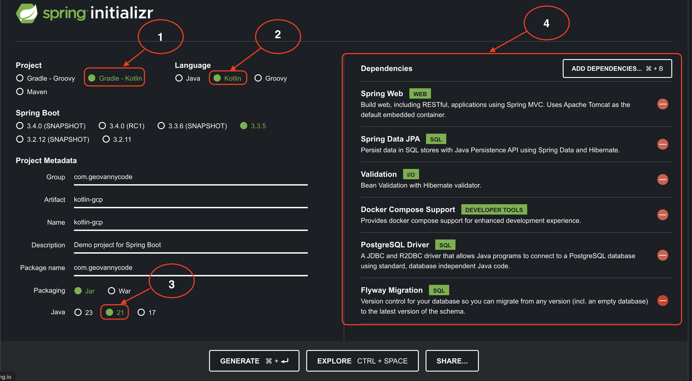
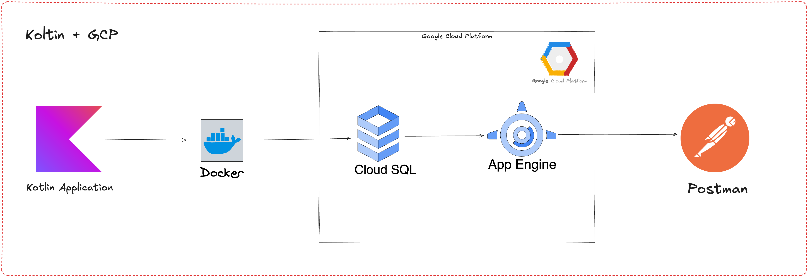

# **Despliegue de una API REST con Kotlin en Google Cloud con PostgreSQL**

## **Introducción**

El desarrollo de aplicaciones modernas requiere herramientas robustas y eficientes para facilitar la creación, el despliegue y el mantenimiento de APIs. Este taller te guiará en el proceso de crear y desplegar una API REST desde cero utilizando Kotlin y Spring Boot, con integración a PostgreSQL como base de datos y despliegue en Google Cloud App Engine. Aprenderás a usar Spring Initializr para configurar un proyecto base de forma sencilla, seleccionar las dependencias clave, y desplegar la aplicación en un entorno gestionado que asegura escalabilidad y disponibilidad.

## **Requisitos para el taller**

1. **Conocimientos previos**:
    - Concepto básico en desarrollo de **APIs REST**.
    - Familiaridad con **Kotlin o Java**.
    - Conceptos básicos de bases de datos relacionales.
2. **Herramientas necesarias**:
    - **Java**: Java Development Kit (JDK) 21.
    - **Google Cloud**: Tener una cuenta activa de **Google Cloud Platform (GCP)**.
    - **Spring Boot**: Versión **3.2.x** o superior.
    - **Base de Datos**: **PostgreSQL 16** o superior (puede ser local o en un contenedor Docker).
    - **IDE**: Recomendado **IntelliJ IDEA** (puedes usar cualquier IDE compatible con Kotlin y Gradle).
    - **Docker Desktop**: UPara crear entornos de desarrollo consistentes y pruebas locales.
    - **Google Cloud SDK**: Instalado y configurado para interacciones con App Engine.
    - **gcloud CLI Tool**: Para manejar despliegues desde la terminal.

## **Paso a paso basado en Spring Initializr**:

1. **Selección del Proyecto y Lenguaje**:
    - Elegimos **Gradle** - **Kotlin** como sistema de construcción y lenguaje de programación (ver "1 y 2" en la imagen). Esto permite aprovechar las ventajas de Kotlin, como su sintaxis concisa y facilidad de uso.

2. **Configuración de Metadatos del Proyecto**:
    - **Group**: `com.geovannycode` define el grupo base del paquete del proyecto.
    - **Artifact**: `kotlin-gcp` como nombre base del artefacto.
    - **Package Name**: Preconfigurado como `com.geovannycode`.
    - **Java Version**: Seleccionamos la versión **21** para aprovechar las características modernas de Java (ver "3").

3. **Dependencias Importantes (marcadas en "4")**:
    - **Spring Web**: Para construir aplicaciones RESTful.
    - **Spring Data JPA**: Persistencia en bases de datos relacionales con Hibernate.
    - **Validation**: Validación de datos en las entidades.
    - **Docker Compose Support**: Simplifica el desarrollo local con Docker.
    - **PostgreSQL Driver**: Conector JDBC para interactuar con PostgreSQL.
    - **Flyway Migration**: Control de versiones para el esquema de la base de datos.

4. **Generación del Proyecto**:
    - Presiona el botón "GENERATE" para descargar el proyecto base y comenzar con el desarrollo.

## **Diagrama de la Aplicación**

## **Descripción del Diagrama de la Aplicación**

El flujo de la aplicación es el siguiente:

1. **Kotlin Application**:
    - La API REST se desarrolla utilizando Kotlin y Spring Boot. La aplicación está empaquetada y configurada para ejecutarse en Google Cloud.

2. **Docker**:
    - Durante el desarrollo local, se utiliza Docker para ejecutar instancias de PostgreSQL y configurar un entorno consistente antes del despliegue en la nube.

3. **Cloud SQL (Google Cloud)**:
    - PostgreSQL se gestiona mediante el servicio **Cloud SQL** de Google Cloud, proporcionando alta disponibilidad, seguridad y escalabilidad para la base de datos.

4. **App Engine (Google Cloud)**:
    - La API REST se despliega en **App Engine**, una plataforma gestionada que simplifica la implementación, escala automáticamente y asegura la disponibilidad.

5. **Postman**:
    - Postman se utiliza para probar los endpoints de la API y validar el funcionamiento correcto de los servicios desplegados.

## **Objetivo del Taller**

Al finalizar el taller, los participantes serán capaces de:

1. Configurar un proyecto Kotlin con Spring Boot desde cero.
2. Gestionar dependencias clave para construir una API REST funcional.
3. Integrar PostgreSQL con Flyway Migration para migraciones controladas.
4. Desplegar y probar la API en Google Cloud App Engine, aprovechando los servicios gestionados como Cloud SQL.
5. Usar herramientas de desarrollo como Docker y Postman para un flujo de trabajo eficiente.